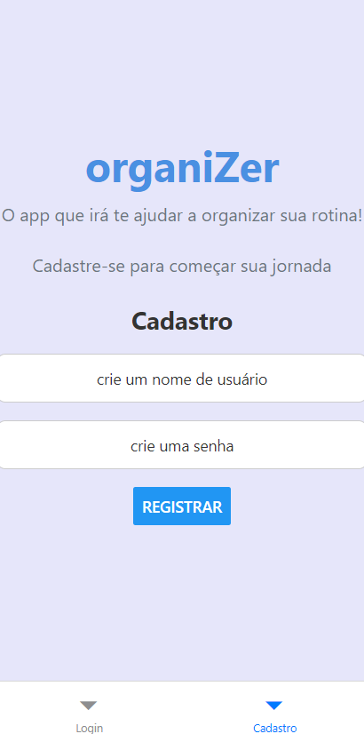
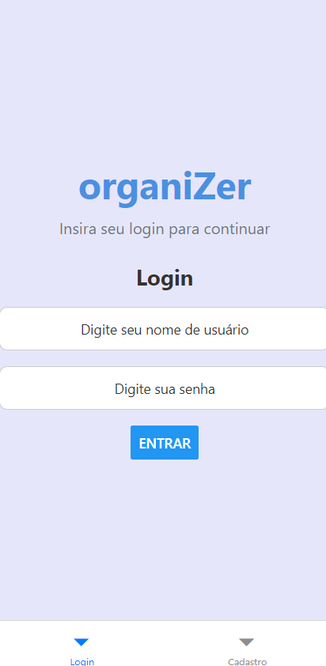
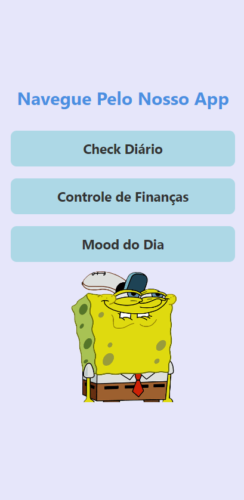
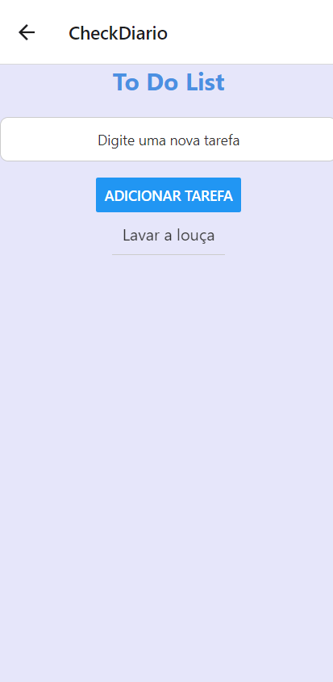
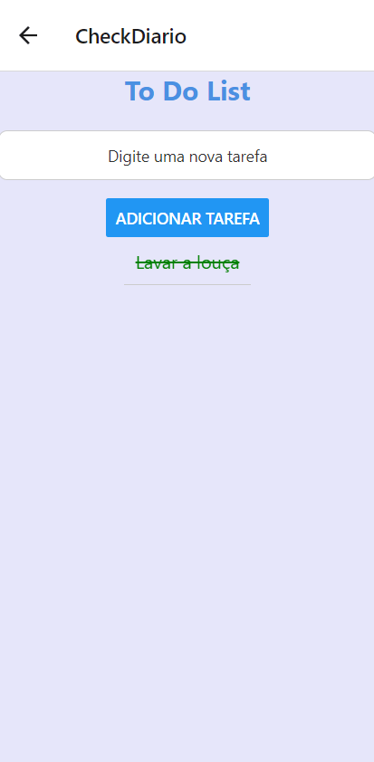
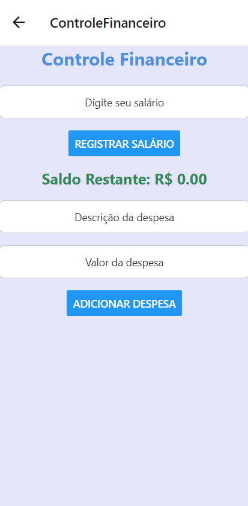
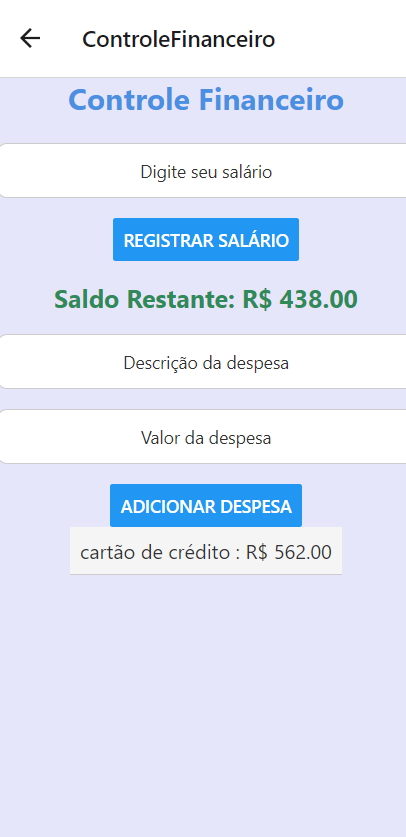

# Organize App
#### Projeto 2 - Desenvolvimento de Aplicação Móvel com React Native

Este projeto foi desenvolvido para aplicar na prática os conhecimentos adquiridos em aulas teóricas e laboratoriais, integrando-os em uma solução única. O **Organize** é um aplicativo de produtividade pessoal, projetado para ajudar os usuários a gerenciar suas atividades diárias e o controle financeiro de forma eficiente e simplificada.

### Motivação
A vida moderna apresenta diversos desafios, como a necessidade de gerenciar múltiplas tarefas e despesas financeiras. Muitas pessoas têm dificuldade em organizar suas rotinas e controlar seus gastos, o que gera sobrecarga e falta de controle. O **Organize** foi desenvolvido para oferecer uma solução prática e eficaz, ajudando os usuários a simplificar suas rotinas diárias, equilibrar suas responsabilidades e finanças de forma intuitiva.

### Objetivo
O objetivo do **Organize** é fornecer uma ferramenta simples e completa para a gestão de tarefas diárias e o controle financeiro pessoal. Através desse aplicativo, os usuários podem desenvolver um hábito de organização, promovendo mais equilíbrio entre suas atividades e seus gastos.

### Funcionalidades

#### 1. Cadastro e Login
- O usuário pode se registrar e fazer login para acessar o aplicativo.
- Os dados dos usuários são armazenados, permitindo que suas informações sejam mantidas para sessões futuras.

#### 2. Check Diário
- O app oferece a possibilidade de adicionar, visualizar e gerenciar tarefas diárias.
- Cada tarefa pode ser marcada como "completa" ou "incompleta", para garantir que as metas sejam cumpridas.

#### 3. Controle de Finanças
- O usuário pode registrar seu salário e adicionar despesas com descrição e valor.
- O aplicativo exibe o saldo restante após cada nova despesa registrada, ajudando a manter o controle dos gastos diários.
- Visão clara do fluxo financeiro, garantindo um controle eficiente das finanças pessoais.

#### 4. Tela "Mood do Dia"
- O usuário pode escolher seu "mood" do dia, com diferentes imagens e sons que representam o estado emocional do dia.
- Ao selecionar um "mood", o som relacionado é tocado, ajudando a definir o clima para o restante do dia, trazendo um toque pessoal e emocional à experiência do aplicativo.

### Como Utilizar o Aplicativo

1. **Cadastro e Login**
   - Abra o aplicativo e crie uma conta com seu nome de usuário e senha.
   - Após o registro, faça login com suas credenciais para acessar o app.

2. **Gerenciar Tarefas**
   - Acesse a seção de tarefas diárias para adicionar novas tarefas.
   - Marque as tarefas como "completa" ou "incompleta" para acompanhar o progresso.

3. **Controle de Finanças**
   - Acesse a seção financeira para registrar o salário e adicionar despesas.
   - O app calculará o saldo restante automaticamente, mostrando um resumo de seus gastos.

4. **Escolher o Mood do Dia**
   - Acesse a tela "Mood do Dia".
   - Escolha uma imagem e um som que representem o seu humor do dia. Ao selecionar, o som será reproduzido para definir o clima.

5. **Aproveite a Organização**
   - Agora você pode acompanhar suas tarefas e finanças de forma organizada, mantendo o controle de tudo em um único lugar.

### Imagens do Projeto

Aqui estão algumas imagens que ilustram o funcionamento do aplicativo:

  
  
  
  
  
  
  

---

**Tecnologias utilizadas:**
- React Native
- Expo
- AsyncStorage
- Expo-AV (para áudio)
- React Navigation

---
